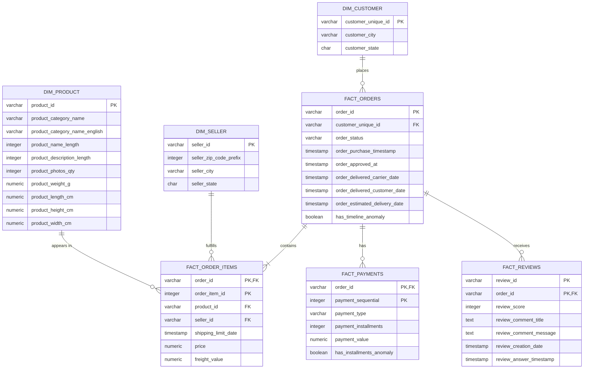
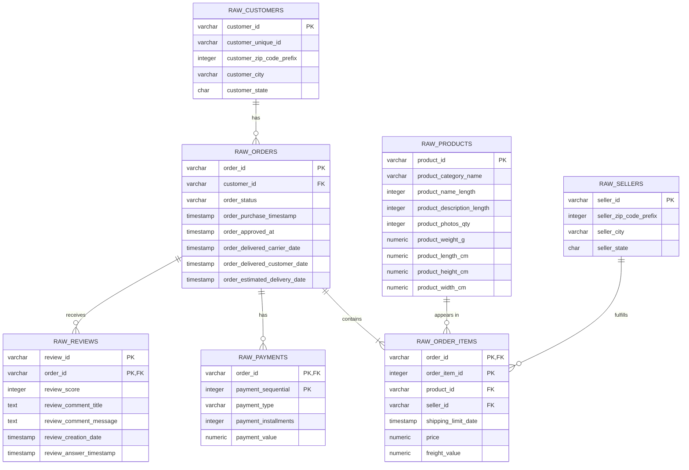

# InsightFlow — Entity Relationship Diagram

| Metadata          | Value                                                                                    |
| ----------------- | ---------------------------------------------------------------------------------------- |
| Date              | 2026-08-13                                                                               |
| Phase             | Database Design                                                                          |
| Related Documents | 01_business_entities.md, 02_key_strategy.md, 03_relationship_design.md, D001, D002, D003 |

---

# 1. Purpose

This document defines the Entity Relationship Diagram (ERD) for the InsightFlow database.

The ERD translates the approved business entities, key strategy, relationship design, and table grain into a visual representation of the database structure.

The ERD focuses on:

- entities;
- primary keys;
- foreign keys;
- cardinality;
- relationship direction;
- Raw Layer structure;
- Analytics Layer structure.

The conceptual entity definitions are documented in:

```text
01_business_entities.md
```

Key strategy is documented in:

```text
02_key_strategy.md
```

Relationship and cardinality definitions are documented in:

```text
03_relationship_design.md
```

Physical PostgreSQL implementation is documented in:

```text
05_database_design.md
```

---

# 2. ERD Scope

InsightFlow uses a two-layer database architecture:

```text
Raw Layer
    │
    │ ETL
    ▼
Analytics Layer
```

The Raw Layer preserves source-system structure.

The Analytics Layer represents the business-oriented analytical model.

The primary ERD for InsightFlow focuses on the **Analytics Layer**, because this is the model consumed by:

- SQL analytics;
- Power BI;
- customer segmentation;
- churn prediction;
- feature engineering.

---

# 3. Analytics Layer ERD

The approved Analytics Layer consists of:

### Dimensions

```text
dim_customer
dim_product
dim_seller
```

### Facts

```text
fact_orders
fact_order_items
fact_payments
fact_reviews
```

The relationships are represented below.



---

# 4. Analytics Entity Relationships

## 4.1 Customer → Order

```text
dim_customer
    │
    │ 1
    │
    │
    │ N
    ▼
fact_orders
```

### Relationship

```text
dim_customer.customer_unique_id
        ↓
fact_orders.customer_unique_id
```

### Cardinality

```text
1 : N
```

One business customer may place multiple orders.

Each order belongs to one business customer.

### Business Meaning

This relationship supports:

- customer purchase history;
- order frequency;
- repeat purchase analysis;
- RFM;
- retention;
- churn analysis.

The relationship uses `customer_unique_id` rather than the Raw Layer `customer_id` because the Analytics Layer represents the business customer rather than the source customer record.

---

# 5. Order → Order Item

```text
fact_orders
    │
    │ 1
    │
    │
    │ N
    ▼
fact_order_items
```

### Relationship

```text
fact_orders.order_id
        ↓
fact_order_items.order_id
```

### Cardinality

```text
1 : N
```

One order may contain multiple purchased items.

Each order item belongs to one order.

### Business Meaning

This relationship allows analysis of:

- products purchased per order;
- order composition;
- product revenue;
- freight cost;
- seller participation.

---

# 6. Product → Order Item

```text
dim_product
    │
    │ 1
    │
    │
    │ N
    ▼
fact_order_items
```

### Relationship

```text
dim_product.product_id
        ↓
fact_order_items.product_id
```

### Cardinality

```text
1 : N
```

One product may appear in many order-item records.

Each order-item record references one product.

### Business Meaning

This relationship supports:

- product sales;
- category revenue;
- product popularity;
- repeat purchase by category;
- product-level customer behavior.

---

# 7. Seller → Order Item

```text
dim_seller
    │
    │ 1
    │
    │
    │ N
    ▼
fact_order_items
```

### Relationship

```text
dim_seller.seller_id
        ↓
fact_order_items.seller_id
```

### Cardinality

```text
1 : N
```

One seller may fulfill many order-item records.

Each order-item record references one seller.

### Business Meaning

This relationship supports:

- seller performance;
- seller revenue;
- seller order volume;
- seller contribution to customer transactions.

---

# 8. Order → Payment

```text
fact_orders
    │
    │ 1
    │
    │
    │ N
    ▼
fact_payments
```

### Relationship

```text
fact_orders.order_id
        ↓
fact_payments.order_id
```

### Cardinality

```text
1 : N
```

One order may contain multiple payment records.

Each payment record belongs to one order.

### Composite Key

The payment table uses:

```text
(order_id, payment_sequential)
```

as its primary key.

`order_id` alone cannot uniquely identify a payment record because multiple payment records may exist for one order.

### Business Meaning

This relationship supports:

- payment method analysis;
- payment value;
- installment analysis;
- transaction-level revenue validation.

The D003 anomaly flag is stored at the payment grain:

```text
has_installments_anomaly
```

---

# 9. Order → Review

```text
fact_orders
    │
    │ 1
    │
    │
    │ N
    ▼
fact_reviews
```

### Relationship

```text
fact_orders.order_id
        ↓
fact_reviews.order_id
```

### Cardinality

```text
1 : N
```

An order may have zero or more review records.

Each review record is associated with one order.

### Composite Key

The review table uses:

```text
(review_id, order_id)
```

as its primary key.

This decision follows the investigation documented in `02_key_strategy.md`.

---

# 10. Review Relationship Consideration

The Olist review dataset contains a known platform characteristic.

Investigation found:

```text
789 review_id values
```

appearing across multiple orders, affecting:

```text
1,603 records
```

The duplicated `review_id` values were consistently associated with the same `customer_unique_id`.

The affected records also showed identical:

- `review_score`;
- `review_creation_date`;
- `review_answer_timestamp`.

Therefore, the duplicated review identifiers are treated as a known platform behavior rather than an unresolved key failure.

The physical grain remains:

```text
One row = one review record associated with one order
```

and the composite key remains:

```text
(review_id, order_id)
```

This means the ERD intentionally models the relationship at the order-review record level rather than forcing `review_id` to be globally unique.

Downstream customer satisfaction analysis should consider this characteristic when interpreting review scores.

---

# 11. Complete Analytics Relationship Matrix

| Parent Entity | Child Entity     | Parent PK          | Child FK           | Cardinality |
| ------------- | ---------------- | ------------------ | ------------------ | ----------- |
| dim_customer  | fact_orders      | customer_unique_id | customer_unique_id | 1:N         |
| fact_orders   | fact_order_items | order_id           | order_id           | 1:N         |
| dim_product   | fact_order_items | product_id         | product_id         | 1:N         |
| dim_seller    | fact_order_items | seller_id          | seller_id          | 1:N         |
| fact_orders   | fact_payments    | order_id           | order_id           | 1:N         |
| fact_orders   | fact_reviews     | order_id           | order_id           | 1:N         |

---

# 12. Analytics Layer Key Structure

The complete key structure represented in the ERD is:

| Table            | Primary Key                    | Foreign Keys                    |
| ---------------- | ------------------------------ | ------------------------------- |
| dim_customer     | customer_unique_id             | —                               |
| dim_product      | product_id                     | —                               |
| dim_seller       | seller_id                      | —                               |
| fact_orders      | order_id                       | customer_unique_id              |
| fact_order_items | (order_id, order_item_id)      | order_id, product_id, seller_id |
| fact_payments    | (order_id, payment_sequential) | order_id                        |
| fact_reviews     | (review_id, order_id)          | order_id                        |

---

# 13. Raw Layer ERD

The Raw Layer preserves the source-system structure.

The primary Raw Layer relationships are:



---

# 14. Raw vs Analytics Relationship Design

The Raw and Analytics ERDs are intentionally different in one important area:

```text
RAW

customer_id
    │
    ▼
orders.customer_id
```

versus:

```text
ANALYTICS

customer_unique_id
    │
    ▼
fact_orders.customer_unique_id
```

This difference follows:

```text
D001 — Customer Identity Strategy
```

The Raw Layer represents source-system records.

The Analytics Layer represents the business customer.

Therefore, the relationship structure changes during ETL.

---

# 15. Entity Grain Represented in the ERD

The ERD must always be interpreted together with table grain.

| Table            | Grain                                              |
| ---------------- | -------------------------------------------------- |
| dim_customer     | One row per unique business customer               |
| dim_product      | One row per product                                |
| dim_seller       | One row per seller                                 |
| fact_orders      | One row per order                                  |
| fact_order_items | One row per purchased item                         |
| fact_payments    | One row per payment record                         |
| fact_reviews     | One row per review record associated with an order |

The grain definitions ensure that cardinality is not interpreted solely from the visual diagram.

---

# 16. Business Process Representation

The Analytics ERD represents the following business process:

```text
Customer
   │
   │ places
   ▼
Order
   │
   ├───────────────┐
   │               │
   │ contains      │ has
   ▼               ▼
Order Item       Payment
   │
   ├───────────────┐
   │               │
   │ references    │ fulfilled by
   ▼               ▼
Product          Seller
   │
   │
   └───────────────┐
                   │
                   ▼
                 Review
```

A more precise representation is:

```text
Customer
    │
    │ 1:N
    ▼
Order
    │
    ├── 1:N ──► Order Item ── N:1 ──► Product
    │                  │
    │                  └── N:1 ──► Seller
    │
    ├── 1:N ──► Payment
    │
    └── 1:N ──► Review
```

---

# 17. ERD Design Principles

The ERD follows the following principles.

### 17.1 Business-Oriented Modeling

The Analytics ERD models business entities and events rather than simply reproducing CSV files.

### 17.2 Explicit Grain

Every table has an explicit grain.

### 17.3 Referential Integrity

Foreign keys connect dependent entities to their parent entities.

### 17.4 Business Customer Identity

The Analytics Layer uses:

```text
customer_unique_id
```

as the customer identity.

### 17.5 Composite Keys Where Required

Composite keys are retained when a single identifier cannot represent table grain:

```text
fact_order_items
(order_id, order_item_id)

fact_payments
(order_id, payment_sequential)

fact_reviews
(review_id, order_id)
```

### 17.6 Raw Data Preservation

The Raw Layer remains faithful to the original Olist source structure.

### 17.7 Analytical Simplification

Supporting lookup datasets such as geolocation and category translation are not unnecessarily promoted into independent Analytics entities.

---

# 18. Relationship Summary

The final Analytics Layer relationship model is:

```text
                         ┌─────────────────┐
                         │  DIM_CUSTOMER   │
                         │                 │
                         │ PK customer_    │
                         │    unique_id    │
                         └────────┬────────┘
                                  │
                                  │ 1:N
                                  ▼
                         ┌─────────────────┐
                         │  FACT_ORDERS    │
                         │                 │
                         │ PK order_id     │
                         │ FK customer_    │
                         │    unique_id    │
                         └───────┬─────────┘
                                 │
               ┌─────────────────┼─────────────────┐
               │                 │                 │
              1:N               1:N               1:N
               │                 │                 │
               ▼                 ▼                 ▼
      ┌────────────────┐ ┌────────────────┐ ┌────────────────┐
      │ FACT_ORDER_    │ │ FACT_PAYMENTS  │ │ FACT_REVIEWS   │
      │ ITEMS          │ │                │ │                │
      │                │ │ PK order_id +  │ │ PK review_id + │
      │ PK order_id +  │ │ payment_seq.   │ │ order_id       │
      │ order_item_id  │ │                │ │                │
      └───────┬────────┘ └────────────────┘ └────────────────┘
              │
       ┌──────┴───────┐
       │              │
      N:1            N:1
       │              │
       ▼              ▼
┌─────────────┐ ┌─────────────┐
│ DIM_PRODUCT │ │ DIM_SELLER  │
│             │ │             │
│ PK product  │ │ PK seller   │
│    _id      │ │    _id      │
└─────────────┘ └─────────────┘
```

---

# 19. Final ERD Decision

The approved Analytics Layer ERD consists of:

```text
3 Dimension Tables
    ├── dim_customer
    ├── dim_product
    └── dim_seller

4 Fact Tables
    ├── fact_orders
    ├── fact_order_items
    ├── fact_payments
    └── fact_reviews
```

with six primary relationship paths:

```text
dim_customer  → fact_orders
fact_orders   → fact_order_items
dim_product   → fact_order_items
dim_seller    → fact_order_items
fact_orders   → fact_payments
fact_orders   → fact_reviews
```

All six relationships are:

```text
1 : N
```

The ERD is therefore consistent with:

```text
01_business_entities.md
        ↓
02_key_strategy.md
        ↓
03_relationship_design.md
        ↓
04_erd.md
        ↓
05_database_design.md
```

The ERD serves as the final logical bridge between the approved relationship model and the physical PostgreSQL implementation.
